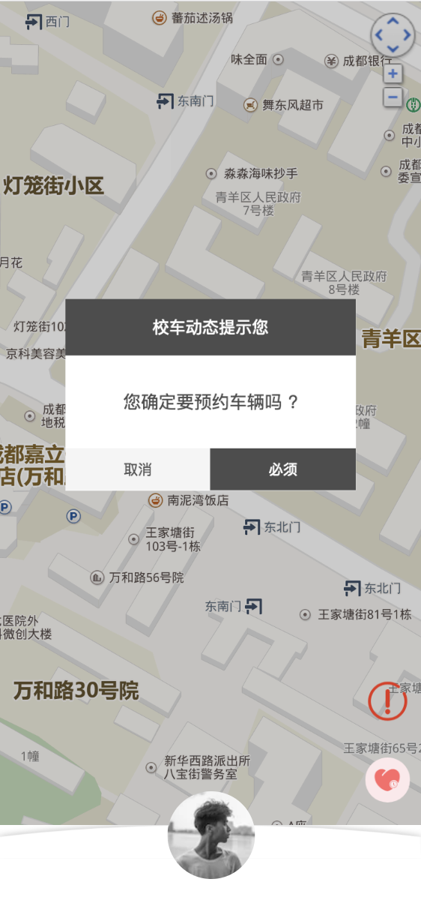

# P-DIALOG-MODAL

## Explain
1 . Confirm Dialog Modal

2 . Support customization，for example: color 、 position 、 text ...

3 . .....(There will be more follow ups)

------

## Demo


--------
## Usage
### 1.1 Installation
```javascript
  npm install p-dialog-modal --save
```
### 1.2 ES6 Import
```javascript
  import ConfirmDialog from 'p-dialog-modal'
  
  export default {
    components: {
      ConfirmDialog
    }
  }
```

## Basic Example
html
```html
  <template>
    <div>
      <confirm-dialog 
        :confrimMesasge=confrimMesasge 
        @onHandeleCancle='handleOnCancle' 
        @onHandeleOnOK='handleOnOk'
      />
    </div>
  </template>
```

js
```javascript
  import ConfirmDialog from 'p-dialog-modal'

  export default {
    components: {
      ConfirmDialog
    },
    data () {
      return {
        confrimMesasge: {
          title: 'i am title',
          text: 'i am content',
          headerColor: '#2894FF',
          okColor: 'red',
          cancelText: 'cancel',
          okText: 'ok',
          marginTop: '300px'
        },
      }
    }
  }

```

### Props
props | type | default | description
---|---|---|---
title | String |  xxx提示您？ | This is the confrime title
text | String | 我帅吗 ? | This is the confrime content
headerColor | String | #4d4d4d | header title background color 
okColor | String | #4d4d4d | ok button background color
cancelText | String | 不帅 | the cancel text
onText | String | 帅 | the ok text
marginTop | String | 30% | margin top

### Event
When you press the confirm button，return true， tigger handleOnOk(data)
```javascript
    handleOnOk (data) {
      console.log(data) // true
    }

```
When you press the cancel button，return false， tigger handleOnCancle(data)
```javascript
    handleOnCancle (data) {
      console.log(data) // false
    }
```